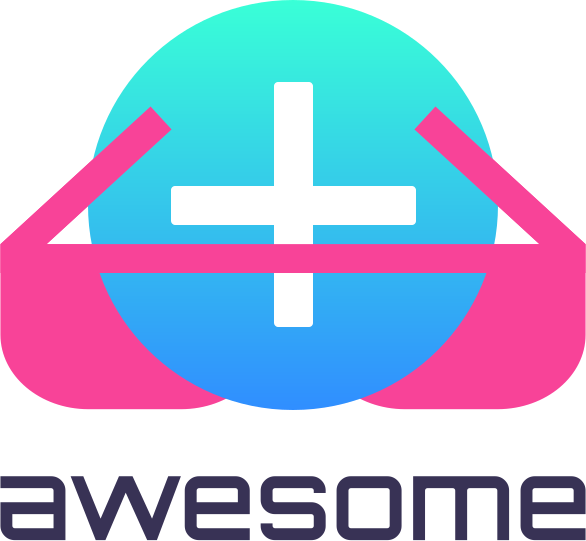

   
  
   

# Awesome Editor.js 

> A curated list of awesome Editor.js tools, libraries and resources.

Inspired by the [awesome](https://github.com/sindresorhus/awesome) list. Feel free to improve this list by contributing!

## Contents

* [Tools](#tools)
  * [Block Tools](#block-tools)
  * [Inline Tools](#inline-tools)
* [Libraries](#libraries)
  * [JavaScript](#javascript)
  * [PHP](#php)
* [Tutorials and sources](#tutorials-and-sources)
* [Projects Using Editor.js](#projects-using-editor-js)
  * [Open source](#open-source)
<!--  * [Apps/Websites](#apps-websites) -->
<!--  * [Commercial Products](#commercial-products) -->

## Tools

### Block Tools

#### Text and typography

* [@editorjs/paragraph](https://github.com/editor-js/paragraph) — text block base tool 
* [@editorjs/header](https://github.com/editor-js/header) — header block
* [@editorjs/quote](https://github.com/editor-js/quote) — tool for quotes
* [@editorjs/warning](https://github.com/editor-js/warning) — warning tool can be used as editorials notifications or appeals
* [@editorjs/delimiter](https://github.com/editor-js/delimiter) — delimiter tool

#### Lists

* [@editorjs/list](https://github.com/editor-js/list) — ordered or unordered (bulleted) lists
* [@editorjs/checklist](https://github.com/editor-js/checklist) — checklists for your texts

#### Images

* [@editorjs/image](https://github.com/editor-js/image) — image block
* [@editorjs/simple-image](https://github.com/editor-js/simple-image) — add images to article by pasting image URLs. no server-side uploader required

#### Files

* [@editorjs/attaches](https://github.com/editor-js/attaches) — attach files to your article

#### Media

* [@editorjs/link](https://github.com/editor-js/link) — link with preview
* [@editorjs/embed](https://github.com/editor-js/embed) — pasted patterns handling and inserts iframe with embedded content.

#### Table

* [@editorjs/table](https://github.com/editor-js/table) — table constructor tool

#### Code

* [@editorjs/code](https://github.com/editor-js/code) — tools for code examples
* [@editorjs/raw](https://github.com/editor-js/raw) — include raw HTML code to your article

### Inline Tools

* [@editorjs/marker](https://github.com/editor-js/marker) — tool for highlighting text-fragments
* [@editorjs/inline-code](https://github.com/editor-js/inline-code) — tool for marking monospace code-fragments
* [@editorjs/underline](https://github.com/editor-js/underline) — underlining text fragments

## Libraries

### JavaScript

* [vue-editor-js](https://github.com/ChangJoo-Park/vue-editor-js) — editor.js for Vue users 
* [react-editor-js](https://github.com/Jungwoo-An/react-editor-js) — the unofficial editor-js component for React

### PHP

* [editorjs-php](https://github.com/editor-js/editorjs-php) — server-side data validation, HTML sanitization and convertation output JSON to the Block objects

## Tutorials and sources

* [editorjs.io](https://editorjs.io) — offical docs

## Projects Using Editor.js

### Open source

* [CodeX Docs](https://github.com/codex-team/codex.docs) — documentation engine
* [CodeX Media](https://github.com/codex-team/codex.media) — platform for building modern website for educational or media organizations
* [CodeX Notes](https://github.com/codex-team/codex.notes) — crossplatform desktop notes application based on Electron and Editor.js

<!--
### Apps/Websites
-->

[Back to top](#contents)
